# LED Strip

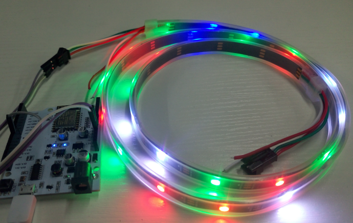

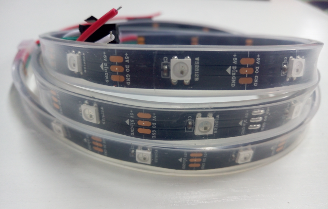

Arduino library for controlling single-wire-based LED pixels and strip such as the Adafruit 30 LED/meter Digital LED strip, the Adafruit FLORA RGB Smart Pixel, the Adafruit Breadboard-friendly RGB Smart Pixel, the Adafruit NeoPixel Stick, and the Adafruit NeoPixel Shield.
We based on these and [LinkSpriteIO](www.linksprite.io) make it can be controled by mobile phone ,to achieve a number of simple functions with [LinkNode D1](http://linksprite.com/wiki/index.php5?title=LinkNode_D1).

### 1 Hardware connection

| LinkNode D1 | LED Strip  |
| ----------- | ---------:|
| 5V          | +5V       |
| GPIO2/D9    | D0        |
| GND         | GND       |

### 2 Install Apk

* Download  [LinkspriteIo.apk](https://github.com/delongqilinksprite/LED_Strip.git)  
* Install Linksprite.apk

### 3 Register Or Login

- Enter to the login page

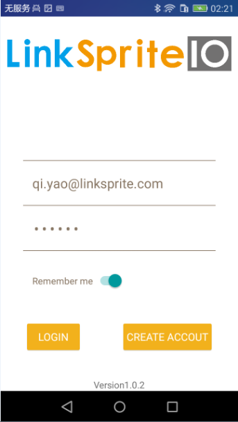

- If not register,Please register

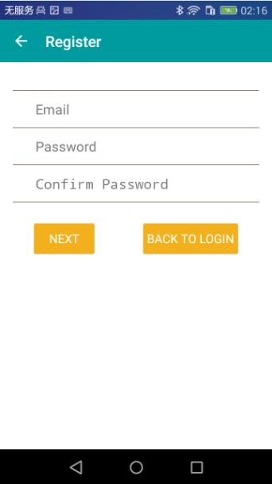

### 4 Create Device

- If not have device,Please click + icon to add device

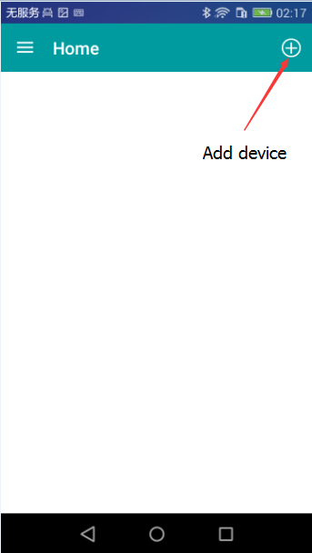

- Please choose LED button  and  other device type will be added later.

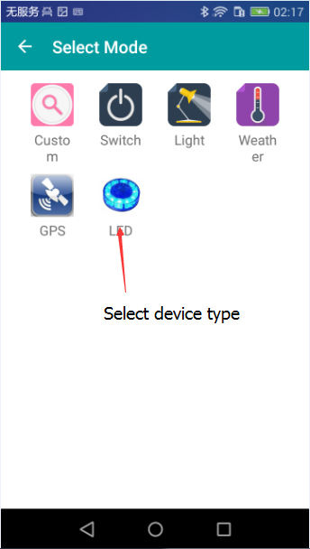

- Please choose ADD button to create a device

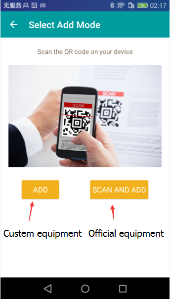

- 
  Fill in the name of the device and group name, and click the confirm button to create the device

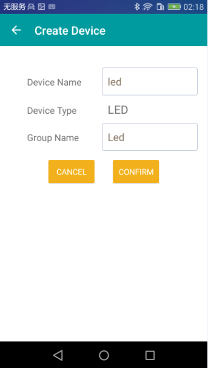

### 5 Upload arduino code

* Download [LinkSpriteIO anduino library](https://github.com/delongqilinksprite/LinkSpriteIO.git)
* Download [NeoPixelBus arduino library](https://github.com/delongqilinksprite/LED_Strip.git)
* Install libraries in Arduino Libraries folder.
* Restart Arduino IDE, then open File->Examples->NeoPixelBus->LinkSpriteIoT sketch.
* Open the website [LinkSpriteIO](www.linksprite.io),and sign in get your deviceID and apikey.

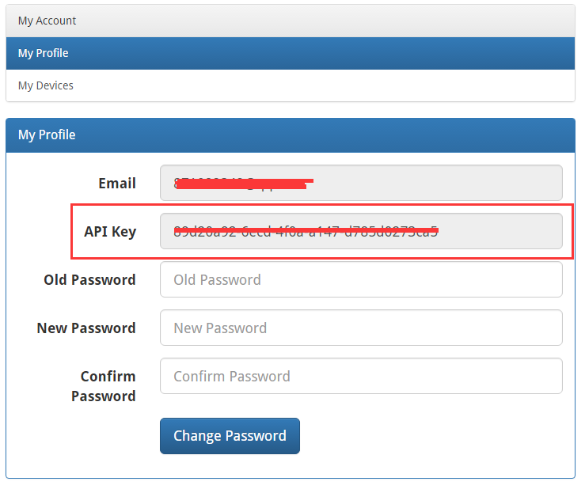  

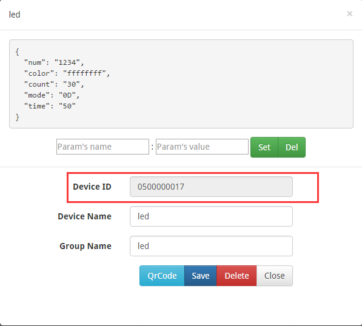

* change deviceID and apikey of program by your LinkSpriteIO　device.

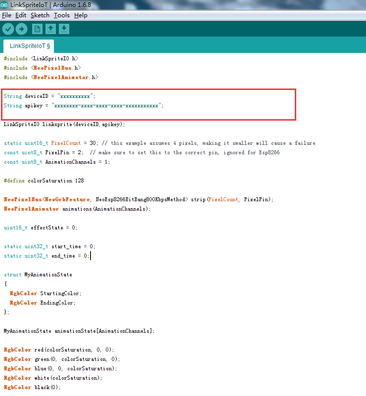

* Upload the code to LinkNode D1,and then you can use your mobile control the led strip.

##### If you've never used D1 LinkNode,you can learn from [here](http://linksprite.com/wiki/index.php5?title=LinkNode_D1).

### 6 LED Strip Control

- Please choose the device button to set device

  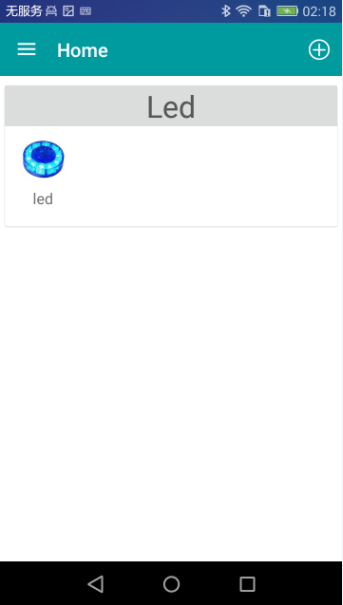

- LED strip how to show：

  > 1.Flowing water lights
  >
  > 2.Bln control
  >
  > 3.Blink
  >
  > 4.Custom
  >

  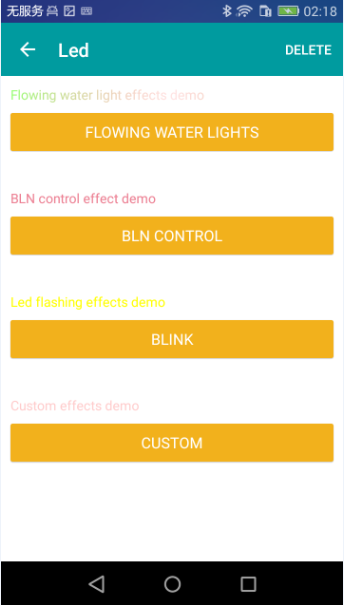

- Set the flowing water lights

  > Set the total number of LED strip:Total
  >

  > Set the time of flowing water lights:Time 
  >

  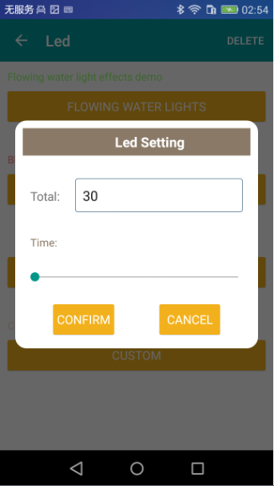

- Set bln control

  > Set the total number of LED strip:Total
  >

  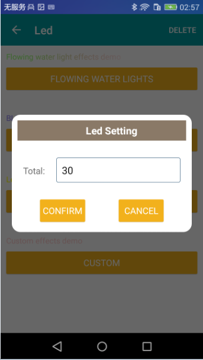

- Set blink

  > Set the total number of LED strip:Total
  >

  > Set the time of blink:Time
  >

  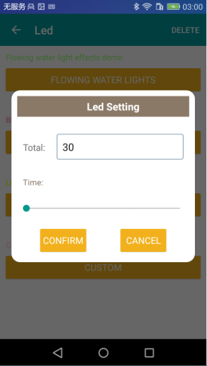

- Set custom

  > Set the total number of LED strip:Total
  >

  > Set the start number which :Start
  >

  > Set the end number:End
  >

  > Set the color of LED:Color (Four color：***Red,Blue,Green,White***)
  >

  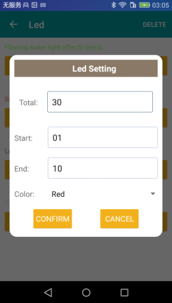
